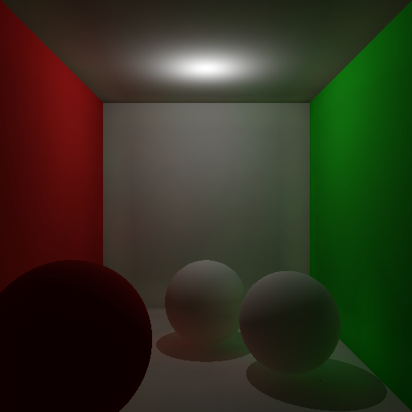
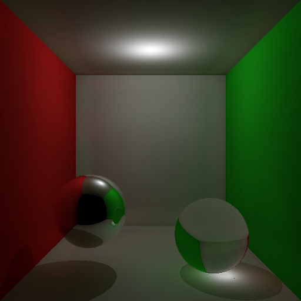
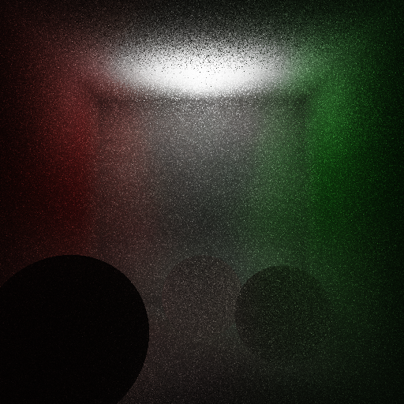
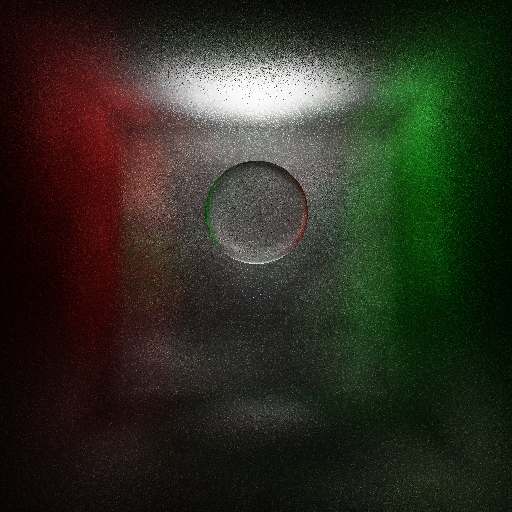

# Photon Mapper
 * Autor: Fernando Peña Bes
 * Autor: José Daniel Subías Sarrato

*Informática Gráfica - Universidad de Zaragoza, curso 2020-21*

## Descripción
Photon Mapper basado en código previo proporcionado por los profesores de la asignatura.

En el [informe](doc/photonmapper_report.pdf) se explica en detalle la implementación del programa.

|||
|:---:|:---:|

|||
|:---:|:---:|

## Cómo compilar

En un entorno Linux deben ejecutarse la siguientes instrucciones para compilar el proyecto:

```
cd Ux
./buildpm.sh
```

## Ejecutar el programa

	./smallpm [opciones ...]

El resultado es una imagen en formato .hdr (Radiance HDR).

### Lista de opciones
Los valores por defecto se muestran entre paréntesis.
	
	-film-name FILE            Nombre del fichero de salida (name_file).

    -film-size-x WIDTH         Anchura de la imagen a renderizar (512).

    -film-size-y HEIGHT        Altura de la iamgen a renderizar (512).

    -scene N                   Especificación de la escena a renderizar debe ser
                               un número entre 1 y 6 (1).

    -pm-total-photons N        Número máximo de fotones a almacenar en cada mapa
                               de fotones: global, cáustico y volumétrico (10000).

    -pm-photons-global N       Número máximo de fotones a almacenar en el mapa
                               de fotones global (10000).

    -pm-photons-caustic N      Número máximo de fotones a almacenar en el mapa 
                               de fotones de cáusticas (10000).

    -pm-photons-volume N       Número máximo de fotones a almacenar en el mapa 
                               de fotones volumétrico (10000).

    -pm-max-photons-shot N     Máximo número de fotones a emitir desde todas 
                               las fuentes de luz en total (100000).

    -pm-nb-nearest-neighbor N  Número de fotones a tener en cuenta para realizar
                               la estimación de la radiancia (10).

    -pm-raytraced-direct       Indica que el cálculo de la luz directa debe ser 
                               realizado mediante trazado de rayos (desactivado).

    -volumetric                Añade un medio participativo al entorno con los valores
                               para los coeficientes de absorción y scattering especificados
                               en el fichero SmallPM/include/ParticipatingMedia.h (desactivado).
